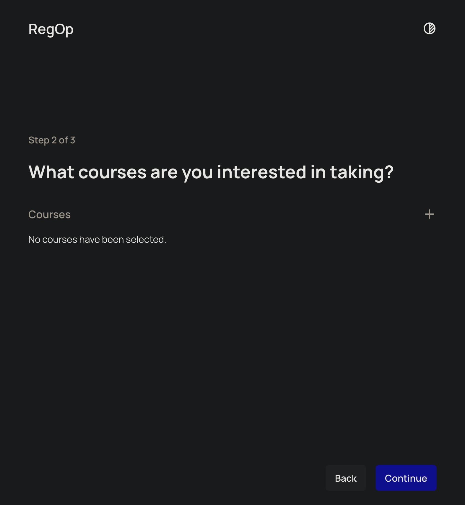
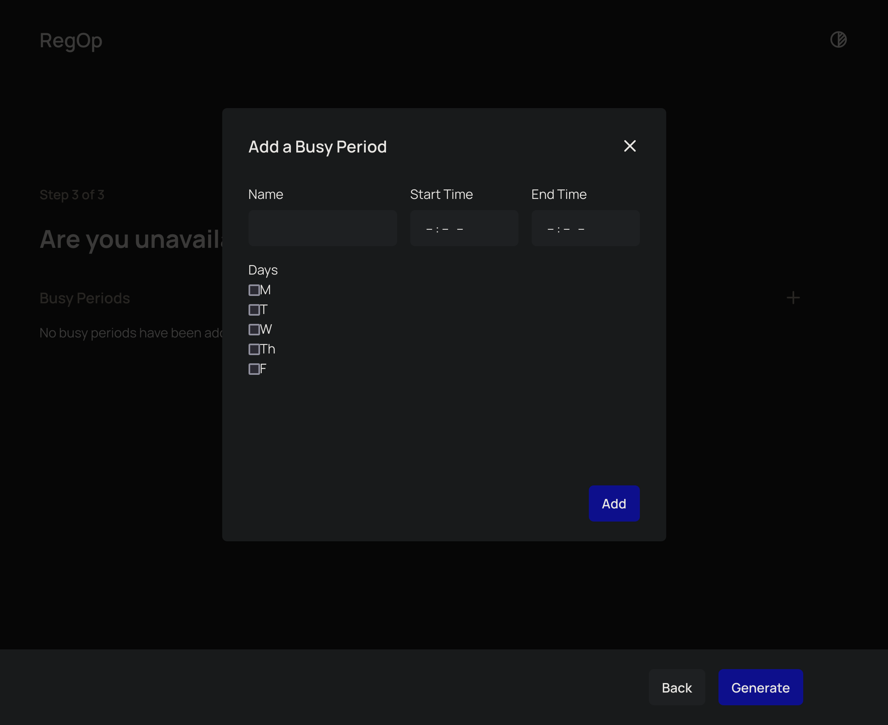
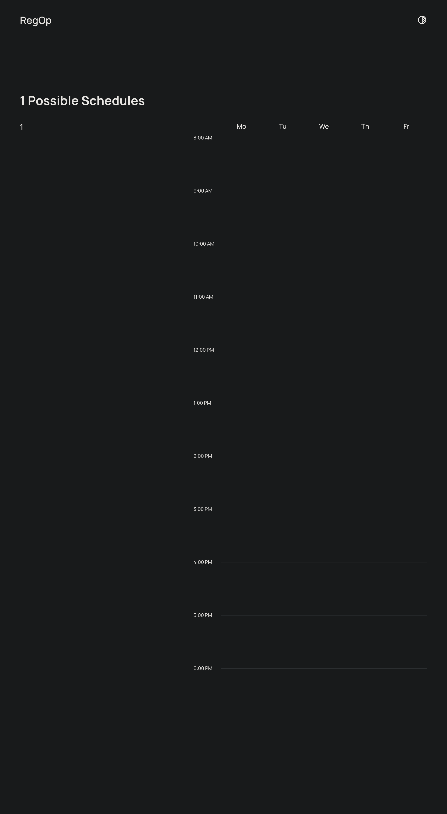

# [Operation Registration](https://regop.up.railway.app/)

The SRS is detailed below. It is also available in a PDF format along with the rest of the project's deliverables in the "Deliverables" directory.

## Group Members 
| Team Member | Role |
---|---
| Matthew Do | Web Integration and Backend Developer |
| Christopher Garcia | Project Lead |
| Luis Gutierrez | Fullstack Developer |
| Phillip Jensen | Software Architect and Backend Programmer |
| Christopher Salinas | UX / UI Developer and Frontend Programmer |

## 1. Introduction
Operation Registration is a website designed to make signing up for the new semester at Fresno State simple.

### 1.1 Purpose 
>This document details the functions and certain design elements of the Operation Registration website.

### 1.2 Intended Audience and Reading Suggestions
>This document is primarily intended to explain the requirements, value, and functionality of the Operation Registration website to those reviewing the project. For such an i ndividual it is recommended that this document be read in its entirety. Any users taht happen to be reading this document are recommended to read only sections one and two.

### 1.3 Product Scope
>Operation Registration is a website intended to streamline schedule creation for Fresno State students. Rather than manually calculating a schedule with non-conflicting course sections, the Operation Registration website will save students time by doing the calculations for them.

### 1.5 References
>Operation Registration Website: https://regop.up.railway.app/
  System Design Document (SDD)

## 2. Overall Description

### 2.1 Product Perspective
>The Operation Registration website is being built to supplement the pre-existing course registration system provided by Fresno State through the My Fresno State portal. The website itself will rely heavily upon currently accessible information that is hosted by Fresno State, as one of the website's primary functions will be to scrape relevant course information from a number of webpages hosted by Frenso State.

### 2.2 Product Functions
>Major functions include: term selection, course selection, busy period input, and schedule generation.

### 2.3 User Classes and Characteristics
>The only and most important user class that is anticipated to use this product are Fresno State students who are preparing to register for courses at Fresno State. It will be assumed that they have little technical expertise and will only make use of the website a few times in the weeks before or of their course registration date.

### 2.4 Operating Environment
>The Operation Registration website is hosted by Railway which builds and hosts a pair of Docker containers (current version is 20.10.14);one for the front end and a second for the backend. Each image is given its own ip address and communicate with one another, but users are only able to access the front end image. The project's GitHub repository is also linked to Railway which automatically updates when changes are made to the source code in the linked repository.

### 2.5 Design and Implementation Constraints
>Since the project will be implemented as a website that consolidates information being hosted by a third party (Fresno State), the website will only be able to function while Fresno State's online resources are functioning properly. Furthermore, any changes to how or where data pertinent to the website will have to be accounted for manually. Additionally, the website will be unable to run on machines that have no web browsers (Internet Edge, Firefox, Google Chrome, Safari) and/or no internet connection.

### 2.6 User Documentation
>Users will have prompts on-screen to guide them through the schedule generation process (see section 3.1).

### 2.7 Assumptions and Dependencies
>It is assumed that
>* Fresno State's web services will remain live
>* The manner in which Fresno State hosts course related content that this project web scrapes will not change
>* Railway (the project's web hosting service) will remain operational

## 3. External Interface Requirements

### 3.1 User Interfaces
> * **Splash Page**

> * **Term Selection**

> * **Course Selection**

> * **Busy Period Input**

>* **Schedule Generation**

### 3.2 Hardware Interfaces
>Since the project is hosted on Railway, it is running on their hardware through the cloud (see section 2.4 for details).

### 3.3 Software Interfaces
>Our software works by communicating with a Flask API that is in charge of handling multiple operations. Its main function is to generate all possible schedules and return them in JSON format so that they can be processed and displayed by the front-end. Our software doesn’t utilize any databases since we extract data in realtime through web scraping. This is done to ensure that we always operate on the most up-to-date information possible.

### 3.4 Communications Interfaces
>In order to access the Operation Registration website, it is necessary to have an internet connection, web browser, and access to Railways's internet domain. Since the website is hosted on Railway, traffice is encrypted throught the HTTPS protocol. 

## 4. System Features
### 4.1 Splash Page
#### 4.1.1 Description
>This feature allows displays the purpose of the website, some context as to how the website came about, and gives the user instruction on how to use the website as a PWA (progressive web app) if they are on a mobile device. It also prominently features a "Get started button" that will take the user to the schedule generator when clicked.

#### 4.1.2 Stimulus/Response Sequences
>In order to view the content of the webpage the user would need to scroll if they are using a screen smaller than the canvas size of the webpage. In order to use the site as a PWA on a mobile device they would need to save the webpage to their homescreen then launch the site from there. In order to use the "Get Started" button the user would need to click on the button (see section 3.1 - Splash Page).

#### 4.1.3 Functional Requirements
>See sections 2.5, 2.7, and 3.4.

### 4.2 Term Selection
#### 4.2.1 Description
>This feature allows the user to select which term they would like to generate schedules for.

#### 4.2.2 Stimulus/Response Sequences
>The user will be presented with three options: the current term, upcoming break term, and the next full term (currently that is Fall 2022, Winter 2023, and Spring 2023). In order to select one of these the user need only click on the corresponding box. (See section 3.1 - Term Selection)

#### 4.2.3 Functional Requirements
> See sections 2.5, 2.7, and 3.4.

### 4.3 Course Selection
#### 4.3.1 Description
> This feature allows a user to input the courses they wish to generate viable schedules for.

#### 4.3.2 Stimulus/Response Sequences
>In order to add classes to be considered for schedule generation, the user would need to press the small "+" symbol to the right of the "Courses" header. They would then enter the department abbreviation and course number to bring up results available in the course catalogue. From here they need simply press the add button next to the course they wish to add to have it added (see section 3.1 - Course Selection).

#### 4.3.3 Functional Requirements
>See sections 2.5, 2.7, and 3.4. 

### 4.4 Busy Period Input
#### 4.4.1 Description
>This feature allows a user to input periods of time that they are unavailable during the week. Doing this filters out generated schedules that would conflict with the time(s) inputted by the user.

#### 4.4.2 Stimulus/Response Sequences
>The user would press the "+" symbol to bring up the input form for them to enter their periods of unavailability. They need simply type in the the times they are unavailable into the time boxes and check the days of the week that the time range they entered applies. After pressing "Add" the input will be saved and additional busy periods can be entered in the same way if the user so desires (see section 3.1 - Busy Period Input).

#### 4.4.3 Functional Requirements
>See sections 2.5, 2.7, and 3.4. The input fields prevent erroneous times from being submitted.

### 4.5 Schedule Generation
#### 4.5.1 Description
>This page shows all of the viable schedules generated.

#### 4.5.2 Stimulus/Response Sequence
>To generate schedules, the user would need to press the "generate" button on the Busy Period Input page (see section 3.1 - Busy Period Input). Once this button is pressed the user will be redirected to the genreated schedules page (see section 3.1 - Schedule Generation) where they need only scroll to see all of the generated schedules.

#### 4.5.3 Functional Requirements
>See sections 2.5, 2.7, and 3.4. This page was the highest priority and end goal when developing the project.

## 5. Other Nonfunctional Requirements

### 5.1 Software Quality Attributes
### 5.1.1 Ease of Use
>It is imperative that the website be intuitive and simple to use, as the primary objective is to minimize time spent creating the schedules.

### 5.1.2 Accuracy and Availability
>Ensuring the website delivers the most up to date results as well as only accurate results is of the upmost priority. The website should never display inaccurate schedules and should be available for reuse each semester.
